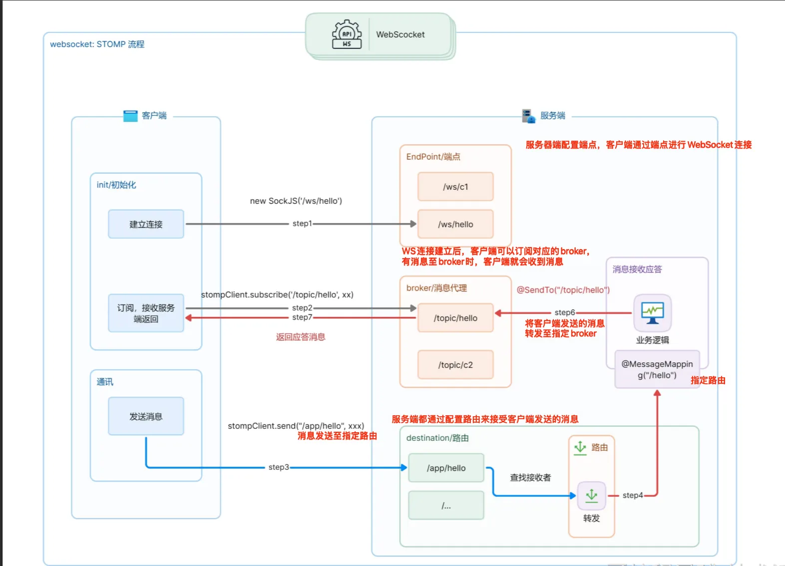

# WebSocket学习

一个简单的WebSocket学习项目， 自己学习websocket的总结<br />

原始博文：
- [190421-SpringBoot高级篇WEB之websocket的使用说明](http://spring.hhui.top/spring-blog/2019/04/21/190421-SpringBoot%E9%AB%98%E7%BA%A7%E7%AF%87WEB%E4%B9%8Bwebsocket%E7%9A%84%E4%BD%BF%E7%94%A8%E8%AF%B4%E6%98%8E/)

<br />

- **WebSocket**: WebSocket是一种在单个TCP连接上进行全双工通信的协议。它使得客户端和服务器之间能够实时地进行双向数据传输，而不需要频繁地建立和关闭连接。这种机制可以提高数据传输的效率和性能。

- **STOMP**: Simple Text Oriented Messaging Protocol 是一种简单而灵活的消息传递协议，它是在HTTP之上实现的。STOMP协议定义了一套简单的命令和帧格式，用于在客户端和服务器之间进行消息传递。通过使用STOMP协议，我们可以实现客户端和服务器之间的双向通讯。 
注意：stomp协议属于websocket的子协议

<p align="center">
  <a href="https://github.com/shaojintian/Best_README_template/">
    
  </a>
</p>

- EndPoint： 服务器配置EndPoint路径，客户端通过路径与EndPoint建立连接

- broker/消息代理： 消息存放的地方，订阅了对应的broker的客户端，会在消息到达broker时收到服务器推送的通知。
服务器可以主动向broker写入消息，从而达到通知客户端的功能。

- destination/路由：服务器端通过配置路由，来接受客户端发送的消息。

- 客户端通过send方法（参数为服务器配置的路由，以及要发送的消息）将消息发送至服务器端，服务端通过@SendTo 将消息发送至指定的broker中。 订阅了该broker的客户端就可以收到消息。


## 目录

- [上手指南](#上手指南)
    - [开发前的配置要求](#开发前的配置要求)
    - [安装步骤](#安装步骤)
- [文件目录说明](#文件目录说明)
- [运行](#运行)
- [作者](#作者)
- [鸣谢](#鸣谢)

### 上手指南

###### 开发前的配置要求

1. Java

###### **安装步骤**

1. Clone the repo

```sh
git clone https://github.com/huangxixiyiqi/websocket_study.git
```

### 文件目录说明

```

├── /imgs/
├── /src/
│  ├── /main/
│  │  ├── /java/
│  │  ├── /resourecs/
├── pom.xml
├── README.md

```


### 运行
```
run src/main/java/com/git/hui/boot/websocket/Application.java
```


### 作者

huangxixi


### 鸣谢

- [190421-SpringBoot高级篇WEB之websocket的使用说明](http://spring.hhui.top/spring-blog/2019/04/21/190421-SpringBoot%E9%AB%98%E7%BA%A7%E7%AF%87WEB%E4%B9%8Bwebsocket%E7%9A%84%E4%BD%BF%E7%94%A8%E8%AF%B4%E6%98%8E/)


